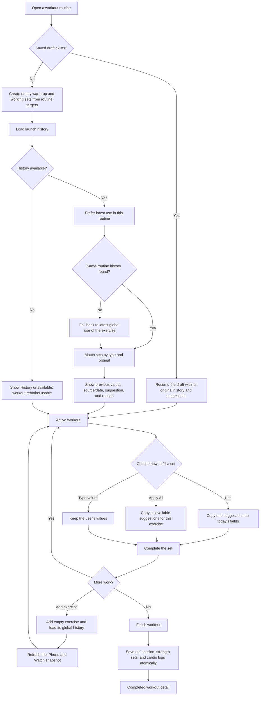
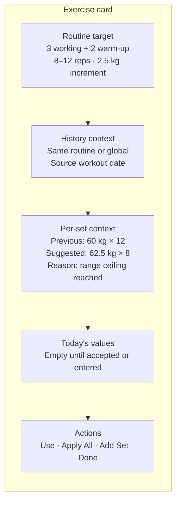
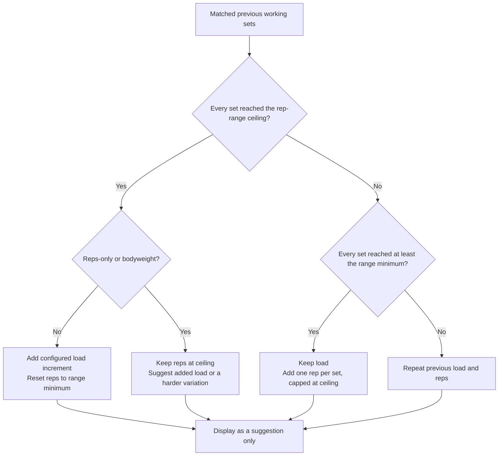
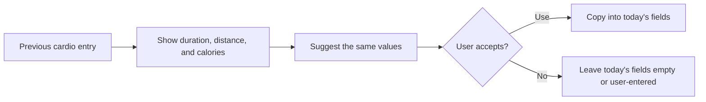
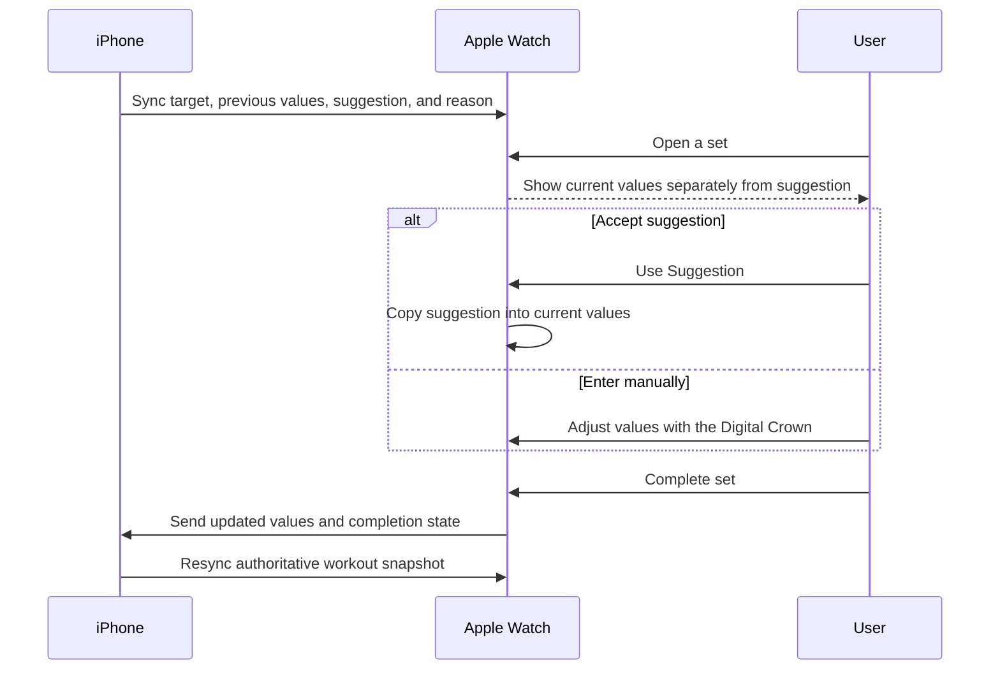

# Guided Workout Progression — UX Flow

## Experience goal

The active workout behaves like an explainable training copilot. It keeps the routine target, previous performance, suggested progression, and today's entered values separate. A suggestion never becomes today's value until the user explicitly chooses **Use**, **Apply All**, or types a value themselves.

## End-to-end workout flow

## What appears on an exercise card

Warm-up rows use `W1`, `W2`, and so on. Their suggestions repeat previous warm-up values and never influence working-set progression. Working sets use their normal ordinal. A set's **Done** control stays disabled while its required current values are empty.

## Strength suggestion rules

Historical sets are matched within their own type by set number. If today's workout has extra sets, the final corresponding historical set is reused; a missing historical match leaves the set without a suggestion.

## Cardio behavior

Cardio history is guidance only in this release; it does not apply automated progression.

## iPhone and Apple Watch interaction

Both devices follow the same explicit-acceptance rule. Completing a strength or cardio set without required current values is blocked.

## Data ownership through the flow

| Information | Meaning | Can it change today's saved result automatically? |
|---|---|---|
| Routine target | Planned sets, rep range, rest, and load increment | No |
| Previous values | What was performed in the selected history session | No |
| Suggested values | A calculated next attempt with an explanation | No |
| Current values | What the user accepted or entered today | Yes; these are saved on completion |

Finishing the workout sends one finalization payload. The database creates the workout session and all child strength/cardio records in one transaction, preventing partially saved workout history.
