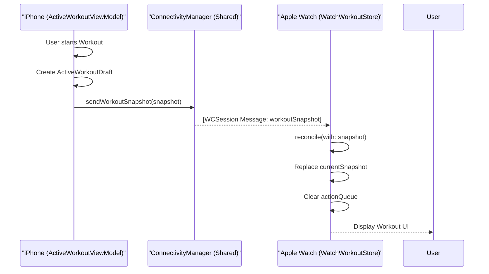
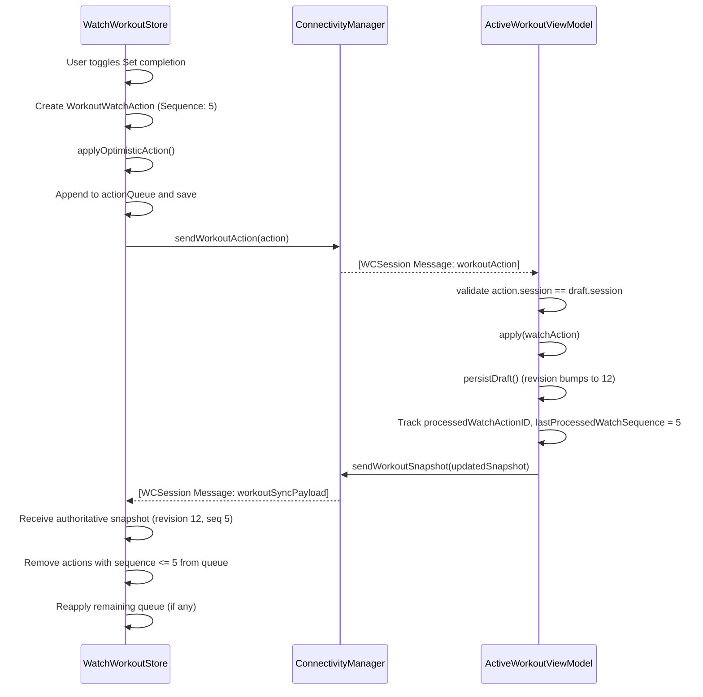
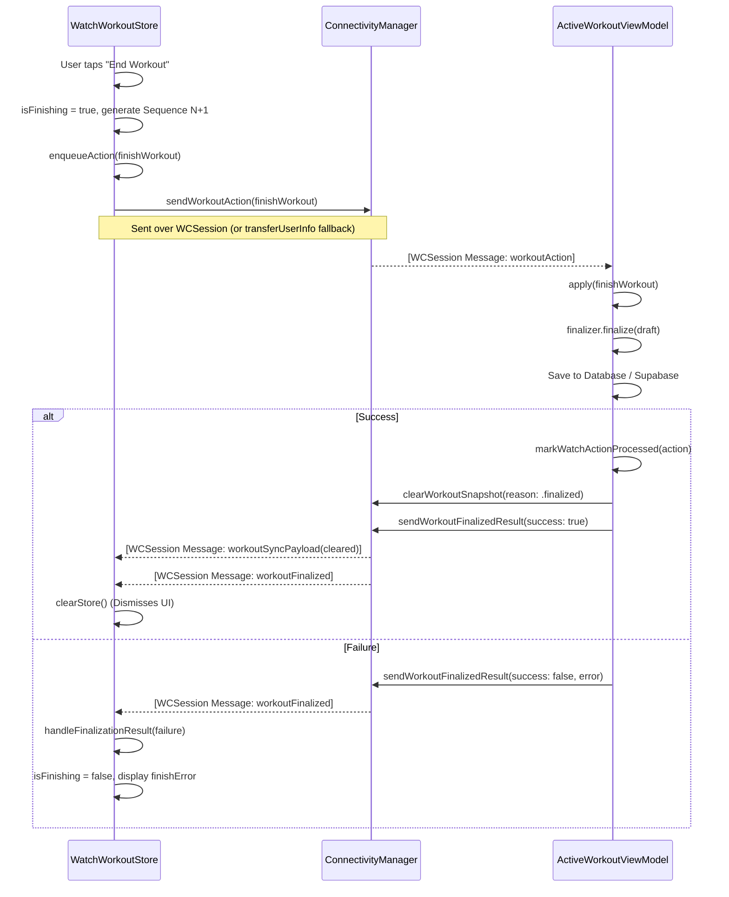

# Watch App Integration Architecture

This document details the data flow and synchronization workflow between the Neural Loop iOS app and the watchOS companion app. The integration enables a seamless, optimistic UI on the Apple Watch for workout tracking, ensuring offline robustness and consistent state reconciliation.

## 1. Core Components

### Shared Layer (`Shared/`)
- **`ConnectivityManager.swift`**: A singleton `WCSessionDelegate` that manages the underlying `WatchConnectivity` session for both iOS and watchOS. It handles encoding/decoding of structured messages and dispatches them via combine publishers and callback closures. Utilizes `updateApplicationContext` for authoritative state and `transferUserInfo` for queued fallback actions.
- **`WorkoutWatchSyncModels.swift`**: Contains the transport-agnostic `Codable` structs used for communication:
  - `ActiveWorkoutSnapshot`: The authoritative state of the workout pushed by the iPhone (includes `revision` and `lastProcessedWatchSequence`).
  - `WorkoutWatchAction`: A specific delta/intent (e.g., toggle set completion, finish workout) initiated by the Watch, identified by an ordered `sequence` number.
  - `WorkoutSyncPayload`: A typed wrapper that encapsulates either an active workout snapshot or a `ClearedWorkoutSnapshot` (which contains the reason a session ended).
  - `WorkoutFinalizedResult`: An acknowledgment from the iPhone indicating whether the workout was successfully saved to the database.

### iOS App (`Neural Loop/`)
- **`ActiveWorkoutViewModel`**: The source of truth for an active workout session. Any changes to the `ActiveWorkoutDraft` are persisted locally and pushed to the Watch. Ensures idempotency by tracking `processedWatchActionIDs` and rejecting out-of-order watch sequence actions.
- **`WorkoutSessionLaunchCoordinator`**: Initiates workouts and handles initial syncs to the Watch.

### watchOS App (`Neural Loop Watch Watch App/`)
- **`WatchWorkoutStore`**: The `@MainActor` central state manager for the Watch app. It maintains the `currentSnapshot`, an optimistic `actionQueue`, handles reconciliation based on sequence numbers and revisions, and computes a single `syncState` enum to drive the UI cleanly.

## 2. Synchronization Strategy

The system uses an **Optimistic UI with Authoritative Snapshots** pattern, relying on sequence numbers and revisions to maintain exact state synchronization:
1. **Watch Action**: User interacts with the Watch. The `WatchWorkoutStore` immediately applies the change locally (optimistic update), appends a strictly-ordered `WorkoutWatchAction` to its persisted `actionQueue`, and attempts to send it to the iPhone. If unreachable, it falls back to `transferUserInfo`.
2. **iPhone Processing**: The iPhone receives the action. It verifies the session matches, checks that the action's `id` hasn't been processed yet, and validates that the `sequence` is next in order to prevent out-of-order application. It applies it to the `ActiveWorkoutDraft` and saves it.
3. **Acknowledgment**: The iPhone bumps the draft's `revision` and sends back a fresh `ActiveWorkoutSnapshot`. This snapshot includes a `lastProcessedWatchSequence` matching the successfully processed action queue number.
4. **Reconciliation**: The Watch receives the authoritative snapshot. If the revision is newer, it replaces its optimistic state with the true state, drops all actions from its queue where `sequence <= lastProcessedWatchSequence`, and reapplies any unacknowledged actions sequentially on top.

---

## 3. Workflows & Diagrams

### A. Workout Initialization Flow

When a user starts a workout on the iPhone, the app immediately sends an initial snapshot to the Watch.

### B. Action Sync Flow (e.g., Completing a Set)

When the user completes a set on the watch, the action is optimistically applied and synced back.

### C. Workout Finalization (End Workout) Flow

Ending a workout is highly critical. The Watch app now handles finalization exactly like any other queued action, guaranteeing in-order execution without race conditions.

## 4. Edge Cases and Resilience

- **Queue Flushing & Offline Fallback:** If the Watch is temporarily disconnected from the iPhone, actions remain in `actionQueue` and are aggressively persisted to `UserDefaults`. If WCSession is unreachable or a live `sendMessage` fails, `ConnectivityManager` immediately pushes the action to `transferUserInfo` to queue it at the system level. When `isReachable` becomes true, the Watch also manually flushes the queue.
- **Stale Drafts:** The Watch tracks snapshot age. If a workout session has been active for more than 24 hours (`isSnapshotStale`), the user can discard it locally via `discardStaleWorkout()`.
- **Application Context Resiliency:** Snapshots are pushed through both normal messaging and `updateApplicationContext`. When the Apple Watch wakes or initializes `WatchWorkoutStore`, `ConnectivityManager` checks the latest background `receivedApplicationContext` to ensure the watch never misses an active workout start.
- **Typed Clear States:** Instead of blindly clearing via `nil` snapshots, the iPhone formally clears the workout by transmitting a `WorkoutSyncPayload.cleared(ClearedWorkoutSnapshot)`, preserving context like `.finalized`, `.cancelledOnPhone`, `.staleExpired`, or `.replacedByNewSession` allowing the watch to understand why it was stopped.
